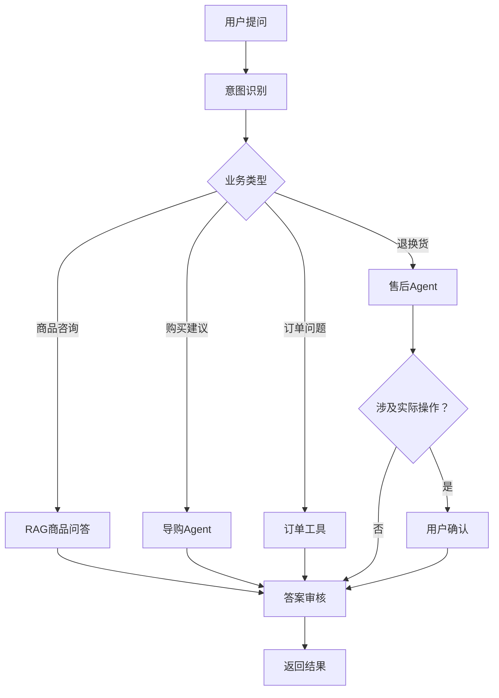

# AI电商导购与售后客服平台

它不是普通聊天机器人，而是一个能够：

- 理解用户需求；
    
- 查询商品和活动知识；
    
- 推荐、比较商品；
    
- 查询订单和物流；
    
- 判断退换货资格；
    
- 经用户确认后创建售后工单；
    
- 在不确定时转人工客服；
    

的电商 Agent。

这个项目的优势是业务非常直观，RAG、Agent、MySQL、Redis、消息队列都能自然出现。

---

# 一、用户到底能用它做什么

例如用户打开一个仿电商网站，向客服提问：

> 我预算5000元，想买一台适合拍照和打游戏的手机，不要苹果，有什么推荐？

系统执行：

1. 识别用户购买需求；
    
2. 提取预算、品牌、拍照、游戏等条件；
    
3. 从MySQL筛选有库存的手机；
    
4. 从RAG知识库检索商品参数、评测和活动规则；
    
5. 比较几款商品；
    
6. 给出推荐理由和引用来源；
    
7. 用户可以直接加入购物车。
    

再例如：

> 我昨天买的耳机右边没有声音，可以退吗？

系统执行：

1. 查询用户订单；
    
2. 确认购买时间、商品状态；
    
3. 从知识库检索退换货规则；
    
4. 判断是否符合售后条件；
    
5. 询问用户是否申请退款；
    
6. 用户确认后创建售后工单；
    
7. 通过消息队列通知售后系统。
    

这个场景既能展示RAG，也能展示Agent真正“完成任务”的能力。

---

# 二、RAG和Agent分别解决什么问题

这是面试时最需要讲清楚的地方。

## RAG负责“知道答案”

RAG知识库包含：

- 商品详细参数
    
- 商品使用说明书
    
- 促销活动规则
    
- 会员权益规则
    
- 物流说明
    
- 退换货政策
    
- 售后维修政策
    
- 常见问题
    
- 用户评测摘要
    

例如用户询问：

> 这个手机支持无线充电吗？

RAG从商品说明书中找到对应内容，然后带着来源回答。

RAG的价值是：

- 商品资料更新后不需要重新训练模型；
    
- 回答有依据和引用；
    
- 减少大模型幻觉；
    
- 不同店铺可以使用不同知识库；
    
- 可以对不同用户进行权限隔离。
    

## Agent负责“完成任务”

Agent可以调用工具：

- 搜索商品
    
- 查询实时库存
    
- 查询订单
    
- 查询物流
    
- 领取优惠券
    
- 加入购物车
    
- 创建退货申请
    
- 创建客服工单
    
- 转人工客服
    

例如：

> 帮我找一款500元以内的降噪耳机，有货的话加入购物车。

这不是单纯问答。Agent需要：

1. 制定任务计划；
    
2. 搜索商品；
    
3. 检查库存；
    
4. 检索商品知识；
    
5. 比较商品；
    
6. 等待用户确认；
    
7. 调用购物车工具。
    

一句话概括：

> RAG让模型“知道公司的知识”，Agent让模型“使用公司的系统完成任务”。

---

# 三、完整业务模块

项目可以分成三个前端入口。

## 1. 模拟电商商城

用户可以：

- 注册登录
    
- 浏览和搜索商品
    
- 查看商品详情
    
- 加入购物车
    
- 创建模拟订单
    
- 查看物流和订单状态
    
- 与AI客服交流
    
- 申请退换货
    

这样项目不再是一个孤零零的聊天框，而是完整电商业务。

## 2. AI客服对话页面

聊天界面展示：

- 流式回答
    
- 商品卡片
    
- 商品对比表
    
- 引用的知识来源
    
- Agent执行步骤
    
- 工具调用状态
    
- 操作确认按钮
    
- 转人工按钮
    

例如：

```text
正在理解你的需求……
正在搜索符合预算的商品……
找到12款商品……
正在检查库存和优惠……
已筛选出3款商品……
```

用户能直观看到Agent在工作。

## 3. 商家运营后台

运营人员可以：

- 管理商品
    
- 上传商品说明书
    
- 上传售后规则
    
- 创建知识库
    
- 查看文档解析状态
    
- 配置Agent工作流
    
- 查看对话记录
    
- 查看用户反馈
    
- 查看RAG命中情况
    
- 查看Token消耗
    
- 查看Agent失败原因
    
- 管理人工客服工单
    

这个后台很重要，它可以突出“全栈项目”的完整性。

---

# 四、推荐的Agent设计

不需要一开始就做十几个Agent。可以设计四个：

|Agent|职责|
|---|---|
|Router Agent|判断是商品咨询、导购、订单还是售后问题|
|Shopping Agent|提取需求，筛选、比较和推荐商品|
|After-sales Agent|查询订单、检索售后规则、创建售后申请|
|Reviewer Agent|检查回答是否有依据、是否存在违规操作|

执行流程：



---

# 五、RAG链路怎么体现技术含量

不要只实现“上传PDF，然后向量搜索”。

建议实现下面的完整链路。

## 文档处理

用户上传商品说明书或者售后政策后：

1. FastAPI接收文件；
    
2. 文件保存到MinIO；
    
3. MySQL记录文档状态；
    
4. RabbitMQ发送解析任务；
    
5. Worker解析PDF、Word、Markdown；
    
6. 根据标题和段落进行语义切片；
    
7. 生成Embedding；
    
8. 写入向量数据库；
    
9. 更新文档状态。
    

前端显示：

```text
等待处理 → 正在解析 → 正在向量化 → 索引完成
```

## 检索优化

可以逐步实现：

- 问题改写
    
- 向量检索
    
- BM25关键词检索
    
- 商品属性过滤
    
- 混合召回
    
- RRF结果融合
    
- Reranker重排
    
- 上下文压缩
    
- 引用来源
    
- 无答案拒答
    

例如用户问：

> 我买的手机进水了，可以免费保修吗？

系统不能只搜索“手机”和“保修”，还需要根据：

- 商品型号
    
- 购买时间
    
- 用户订单
    
- 保修政策版本
    
- 人为损坏条款
    

进行检索和判断。

这就比普通知识库问答更有含金量。

---

# 六、MySQL、Redis和消息队列怎么自然加入

## MySQL

保存核心业务数据：

- 用户
    
- 商品
    
- SKU
    
- 库存
    
- 购物车
    
- 订单
    
- 物流
    
- 优惠券
    
- 售后工单
    
- 知识库
    
- 文档
    
- 会话
    
- Agent任务
    
- 工具调用记录
    

可以重点实现：

- 商品与SKU表设计
    
- 订单状态机
    
- 库存扣减
    
- 优惠券领取
    
- 售后状态流转
    
- 乐观锁防止库存超卖
    
- 唯一索引保证任务幂等
    

## Redis

Redis可以用于：

- 商品详情缓存
    
- 热门商品缓存
    
- 购物车缓存
    
- 用户会话
    
- Agent短期记忆
    
- RAG检索结果缓存
    
- Embedding缓存
    
- 接口限流
    
- 分布式锁
    
- 库存预扣
    
- Token用量统计
    

比较有含金量的一个功能是“秒杀优惠券”：

1. Redis判断库存；
    
2. Lua脚本完成原子扣减；
    
3. 消息发送到RabbitMQ；  
    4.消费者异步写入MySQL；
    
4. 使用用户ID和优惠券ID保证幂等；
    
5. 消费失败进入重试和死信队列。
    

这样就能自然展示互联网高并发场景。

## RabbitMQ

处理异步任务：

- 文档解析
    
- Embedding生成
    
- 知识库重建
    
- 订单创建
    
- 优惠券异步落库
    
- 售后工单通知
    
- Agent长任务
    
- RAG自动评测
    
- 对话内容异步统计
    

需要实现：

- ACK
    
- 消息重试
    
- 死信队列
    
- 延迟队列
    
- 幂等消费
    
- 消息积压监控
    

---

# 七、可以使用的设计模式

|设计模式|项目中的用途|
|---|---|
|Strategy|切换向量检索、混合检索和不同大模型|
|Factory|根据意图创建导购、订单、售后Agent|
|Adapter|统一不同模型和向量数据库接口|
|State|管理订单、售后工单和Agent任务状态|
|Chain of Responsibility|输入检查、权限检查、注入检测、输出审核|
|Observer|Agent执行状态通过SSE推送前端|
|Repository|封装MySQL访问|
|Template Method|统一不同Agent的执行流程|
|Circuit Breaker|大模型或外部服务异常时熔断|
|Outbox Pattern|保证数据库操作和消息投递最终一致|

其中最值得深入的是：

- Strategy
    
- State
    
- Chain of Responsibility
    
- Outbox Pattern
    

不用刻意把所有模式都用上。

---

# 八、前后端技术选型

## React前端

建议使用：

```text
React
TypeScript
Vite
Ant Design
React Query
Zustand
React Router
ECharts
React Flow
SSE
```

主要页面：

```text
商城首页
商品详情
购物车
订单中心
AI客服
商家后台
知识库管理
Agent工作流
调用链追踪
数据统计看板
```

## FastAPI后端

```text
FastAPI
SQLAlchemy
Pydantic
Alembic
LangGraph
Celery或自建RabbitMQ Worker
Redis
MySQL
Qdrant
MinIO
OpenTelemetry
Prometheus
```

建议采用领域划分：

```text
backend/
├── modules/
│   ├── user/
│   ├── product/
│   ├── order/
│   ├── coupon/
│   ├── after_sales/
│   ├── knowledge/
│   ├── agent/
│   └── evaluation/
├── infrastructure/
│   ├── mysql/
│   ├── redis/
│   ├── rabbitmq/
│   ├── vector_store/
│   └── llm/
├── mcp_servers/
└── api/
```

---

# 九、一个很适合演示的完整案例

面试时可以直接演示：

> 我想给女朋友买一个1000元以内的生日礼物，她喜欢拍照，三天后过生日，最好明天能到。

Agent执行：

1. 提取预算、用途和时间要求；
    
2. 查询适合拍照的商品；
    
3. RAG检索商品卖点和使用说明；
    
4. 查询实时库存；
    
5. 查询用户收货地址；
    
6. 判断配送时间；
    
7. 查询当前优惠活动；
    
8. 推荐三款商品并解释区别；
    
9. 用户选择其中一款；
    
10. Agent领取优惠券并加入购物车；
    
11. 用户确认后创建模拟订单。
    

这个案例同时展示了：

- 自然语言理解
    
- 任务规划
    
- RAG
    
- 多步工具调用
    
- 个性化推荐
    
- MySQL业务查询
    
- Redis缓存
    
- 订单系统
    
- 人机确认
    
- 流式前端交互
    

非常容易让面试官理解。

---

# 十、项目开发顺序

## 第一阶段：电商基础业务

先完成：

- 用户登录
    
- 商品管理
    
- 商品搜索
    
- 购物车
    
- 模拟订单
    
- 售后工单
    
- 商家后台
    

## 第二阶段：RAG知识库

完成：

- 文档上传
    
- RabbitMQ异步解析
    
- 文档切片
    
- 向量检索
    
- 混合检索
    
- Reranker
    
- 引用来源
    
- 管理后台
    

## 第三阶段：Agent

完成：

- 意图识别
    
- 导购Agent
    
- 订单Agent
    
- 售后Agent
    
- 工具调用
    
- 短期记忆
    
- 任务状态保存
    
- 人工确认
    

## 第四阶段：互联网工程能力

完成：

- Redis多级缓存
    
- 接口限流
    
- 秒杀优惠券
    
- 分布式锁
    
- 幂等消费
    
- 消息重试
    
- 死信队列
    
- 熔断降级
    
- 全链路监控
    
- 并发压测
    

---

# 十一、项目最合适的名字

可以从这些里面选：

- ShopMind：智能电商导购与客服平台
    
- MallAgent：电商多智能体服务平台
    
- IntelliShop：智能导购与售后Agent
    
- CommerceCopilot：电商运营与客服助手
    
- SmartMall AI：面向电商场景的RAG Agent平台
    

我比较推荐：

> **MallAgent——基于RAG与多智能体的电商导购及售后服务平台**

它的最大优势是：业务很好懂，同时又能自然体现RAG和Agent的区别——RAG负责基于商品及规则提供可靠知识，Agent负责查询订单、检查库存、推荐商品和创建售后任务。