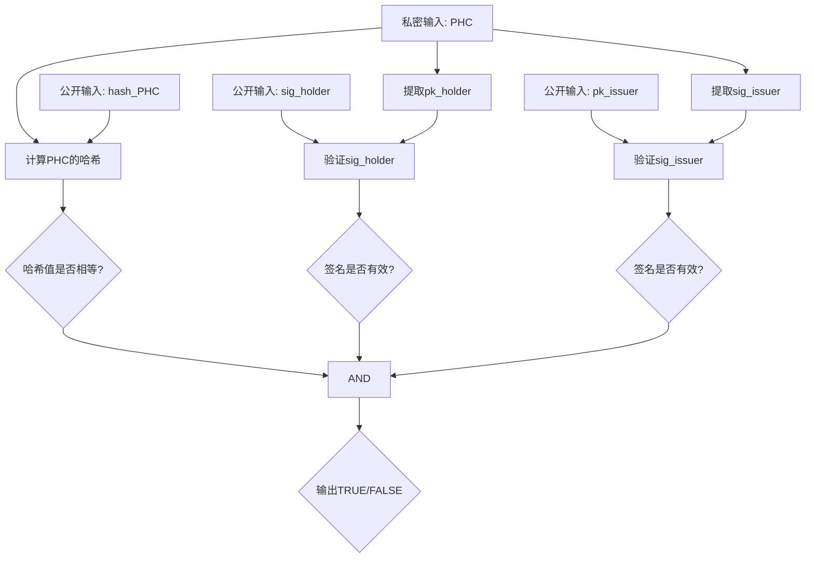
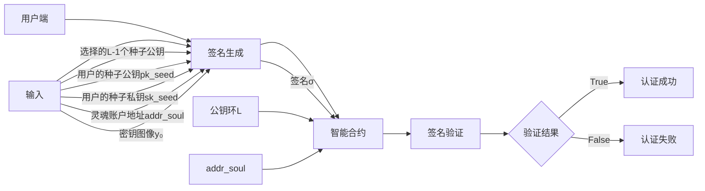

## 论文基本信息

- **标题**: Linking Souls to Humans: Blockchain Accounts with Credible Anonymity for Web 3.0 Decentralized Identity
- **作者**: Taotao Wang, Zibin Lin, Shengli Zhang, Long Shi, Qing Yang, Boris Düdder
- **会议**: WWW '25 (ACM Web Conference 2025)
- **时间**: 2025年4月28日-5月2日，悉尼
- **机构**: 深圳大学、南京理工大学、哥本哈根大学

------

## 研究背景

### 数字身份的三个发展阶段

数字身份系统经历了三个演进阶段，分别对应互联网的三个时代：

| 阶段 | 身份类型     | 对应时代 | 特点                             | 问题                                 |
| ---- | ------------ | -------- | -------------------------------- | ------------------------------------ |
| 1    | 中心化身份   | Web 1.0  | 用户创建，应用提供商管理         | 多账户管理复杂，数据泄露风险         |
| 2    | 联盟身份     | Web 2.0  | 少数大型提供商管理，可跨应用使用 | 数据霸权，用户数据集中在少数巨头手中 |
| 3    | 去中心化身份 | Web 3.0  | 用户自主创建和管理（自主权身份） | 完全匿名导致无法追溯真实社交关系     |

### Web 3.0的核心价值

Web 3.0的革命性转变在于：

- **用户拥有数据主权**
- 数据不被应用提供商占有
- 需要去中心化身份系统支撑

### 当前区块链账户系统的问题

区块链账户系统是Web 3.0去中心化身份的理想原型，但存在以下问题：

1. **完全匿名的缺陷**：
   - 用户可以无需认证创建多个账户
   - 无法准确记录真实用户之间的社交关系和互动
   - 用户与区块链身份之间的映射关系模糊
2. **Soulbound Token的局限性**：
   - Vitalik Buterin提出的"灵魂"（Soul）概念和"灵魂绑定代币"（Soulbound Token）
   - 用户仍可创建多个"灵魂"账户来抹除、转移或隐藏关系
   - 无法真实反映人类社会中的真实关系

------

## 研究方案：zkBID

### 核心目标

zkBID（Zero-Knowledge Blockchain-account-based Web 3.0 decentralized IDentity）旨在实现：

1. **一对一映射**：将灵魂（区块链账户）与人类（用户）建立一对一关联
2. **去中心化**：无需第三方中心化机构参与
3. **隐私保护**：隐藏身份与账户之间的绑定关系（即匿名）
4. **可信性**：每个账户在区块链上的信用与对应的真实用户一对一映射

### 关键技术

zkBID采用三大核心技术：

1. **零知识证明（zkSNARK）**
2. **可链接环签名（Linkable Ring Signature）**
3. **区块链智能合约（Smart Contracts）**

------

## 技术预备知识

### 1. 可验证凭证（Verifiable Credentials, VC）

由W3C提出的去中心化标识符（DID）体系中的关键组件。

**三个主要角色**：

- **颁发者（Issuer）**：签发凭证
- **持有者（Holder）**：拥有凭证
- **验证者（Verifier）**：验证凭证

**VC的数据结构**（JSON对象）：

```json
{
  "metadata": "包含颁发者DID、颁发日期、声明类型",
  "claims": "关于持有者的断言，包括持有者DID",
  "proofs": "颁发者的数字签名"
}
```

### 2. 人格凭证（Personhood Credentials, PHC）

**定义**：证明用户是真人而非AI的数字凭证

**运作流程**：

#### 注册流程

用户向PHC颁发者证明自己是真人 → 颁发者签发PHC

#### 使用流程

第三方服务可要求用户出示PHC作为授权过程的一部分

**验证方法**（颁发者确保用户是真人的三种主要方式）：

1. **现有身份文件**
   - 基于政府签发的身份证件
   - 利用现有可信来源
2. **生物识别信息**
   - 测量持久且唯一的人体特征（掌纹、虹膜、指纹）
   - 确保是真人且限制每人只注册一次
3. **信任网络（Web of Trust）**
   - 通过社交图谱分析区分真人和机器
   - 检测用户是否曾获得过凭证

**在zkBID中的应用**：

- PHC以VC形式作为每个人类用户的身份凭证

### 3. zkSNARK算法

**全称**：Zero-knowledge Succinct Non-interactive Argument of Knowledge

**优势**：

- **简洁性（Succinct）**：证明大小仅几个字节，验证时间短
- **非交互性（Non-interactive）**：证明者和验证者无需同步通信

**工作原理**：

使用算术电路表示，包含基本运算：加、减、乘、除

**F-算术电路**：

- 输入：$x \in \mathbb{F}^n$
- 辅助输入（见证）：$w \in \mathbb{F}^h$
- 输出：$C(x, w) \in \mathbb{F}^l$

**三个算法组件**：

1. **密钥生成（KEYGEN）**

   ```
   (PK, VK) ← KEYGEN(1^λ, C)
   ```

   - 输入：安全参数λ和电路C
   - 输出：证明密钥PK和验证密钥VK

2. **证明生成（PROVE）**

   ```
   π ← PROVE(PK, x, W)
   ```

   - 输入：PK、公开输入x、私密见证W
   - 输出：证明π

3. **证明验证（VERIFY）**

   ```
   1/0 ← VERIFY(VK, x, π)
   ```

   - 输入：VK、公开输入x、证明π
   - 输出：接受（1）或拒绝（0）

**zkBID采用的算法**：Groth16

- 原因：验证速度快，证明紧凑
- 适用于大规模应用和大型区块链网络

### 4. 可链接环签名（Linkable Ring Signature）

**基本环签名**：

- 验证者可以确认签名由预定义集合中的某个成员创建
- 但无法确定具体是哪个成员

**可链接环签名的额外特性**：

- 允许验证者确定两个签名是否由同一签名者生成

**四个算法组件**：

1. **密钥生成（GEN）**

   ```
   (pk, sk) ← GEN(1^k)
   ```

2. **签名生成（SIG）**

   ```
   σ ← SIG(1^k, 1^n, m, L, sk)
   ```

   - 输入：安全参数k、环大小n、消息m、公钥环L、私钥sk
   - 输出：签名σ

3. **签名验证（VER）**

   ```
   1/0 ← VER(1^k, 1^n, m, L, σ)
   ```

4. **可链接性检查（LINK）**

   ```
   1/0 ← LINK(1^k, 1^n, m1, m2, σ1, σ2, L1, L2)
   ```

   - 判断两个签名是否由同一签名者生成

**关键属性**：

- **签名者模糊性（Signer Ambiguity）**：
  - 攻击者正确猜测真实签名者的概率不超过 1/(n-t)
  - 其中n是环大小，t是攻击者拥有的私钥数量
- **可链接性（Linkability）**：
  - 同一签名者（相同私钥）签名的两条消息可被验证为关联

**zkBID采用的算法**：MLSAGS（Multilayered Linkable Spontaneous Anonymous Group Signature）

- 原因：实现可链接性的技术复杂度较低，适合在智能合约上实现

**密钥图像（Key Image）机制**：

```
y₀ ← sk * Hₚ(pk)
```

- y₀对于给定的(sk, pk)对是唯一的
- 所有由同一签名者产生的签名都带有相同的密钥图像
- 即使环中的公钥改变，签名仍可链接

------

## zkBID系统设计

### 整体架构

#### 映射关系图

```
真实用户 → PHC（人格凭证）→ PHC哈希 → 种子公钥 → 灵魂账户
```

**关系说明**：

- 实线：可见的一对一关系
- 虚线：不可见但可验证的关系
- 箭头：单向计算关系

#### 核心设计理念

1. **隐私保护**：
   - PHC的具体内容不上链，只存储零知识证明
   - 灵魂账户与种子公钥的关联不可见
2. **可信匿名**：
   - 账户是匿名的（无法追踪到真实身份）
   - 账户是可信的（确实与真实用户一对一绑定）
3. **完全去中心化**：
   - 所有数据由用户生成
   - 通过区块链上的智能合约验证

### IVAC流程（Identity Verification and Account Certification）

zkBID通过三个子流程生成具有可信匿名性的灵魂账户：

```
[用户] → [注册信息生成] → [用户身份验证] → [灵魂账户认证] → [灵魂账户]
          ↓                    ↓                    ↓
       零知识证明          智能合约验证        可链接环签名
```

------

## 详细设计

### 阶段1：注册信息生成

**目标**：生成隐私保护的注册信息，不泄露PHC的具体内容

#### PHC格式设计

zkBID中的PHC采用VC格式，包含三个关键字段：

```json
{
  "credentialSubject": {
    "publicKeyMultibase": "pk_holder"  // 持有者公钥
  },
  "proof": {
    "publicKeyMultibase": "pk_issuer",  // 颁发者公钥
    "signature": "sig_issuer"           // 颁发者签名
  }
}
```

#### 零知识证明生成流程

**Protocol 1: PHC的ZK证明生成**

```
输入：
- hash_PHC：PHC的哈希值
- sig_holder：持有者的签名
- pk_issuer：颁发者的公钥
- PHC：完整的PHC数据

设置：
(PK, VK) ← zkSNARK.KEYGEN(1^λ, C)

生成证明：
1. 公开输入 x ← (hash_PHC, sig_holder, pk_issuer)
2. 私密见证 W ← PHC
3. π ← zkSNARK.PROVE(PK, x, W)

输出：π（零知识证明）
```

#### 算术电路验证逻辑



**验证步骤**：

1. **验证哈希正确性**：
   - 计算PHC的哈希
   - 检查是否等于公开输入中的hash_PHC
   - 确保hash_PHC确实从PHC计算得出
2. **验证所有权**：
   - 从PHC中提取持有者公钥pk_holder
   - 用pk_holder验证sig_holder
   - 证明用户拥有PHC
3. **验证PHC有效性**：
   - 从PHC中提取颁发者签名sig_issuer
   - 用pk_issuer验证sig_issuer
   - 证明PHC由可信颁发者签发

**输出**：

- 如果所有检查通过：输出TRUE和证明π
- π证明的声明："PHC哈希正确，持有者拥有PHC，PHC由颁发者签发"
- 关键：不泄露PHC的具体内容

### 阶段2：用户身份验证

**目标**：

1. 验证用户的真人身份（通过验证ZK证明）
2. 防止重复注册（检查PHC哈希未被使用）

#### 智能合约流程

**Protocol 2: 用户身份验证智能合约**

```
输入：
- π：零知识证明
- hash_PHC：PHC哈希
- sig_holder：持有者签名
- pk_seed：种子公钥

执行步骤：
1. pk_issuer ← GetIssuerPK()  // 获取预定义的颁发者公钥
2. validation ← zkSNARK.VERIFY(VK, hash_PHC, pk_issuer, π)
3. if validation ≠ 1:
     return "验证失败"
4. stored ← Traverse(hash_PHC)  // 检查是否已注册
5. if stored ≠ 0:
     return "已经注册"
6. Store(hash_PHC, pk_seed)  // 存储为键值对
7. return "认证成功"
```

#### 用户操作步骤

1. **生成种子密钥对**：

   ```
   (pk_seed, sk_seed) ← MLSAGS.GEN(1^k)
   ```

2. **构造交易**：

   - 数据字段包含：π, hash_PHC, sig_holder, pk_issuer, pk_seed
   - 发送到身份验证合约地址

3. **合约验证**：

   - 验证颁发者公钥匹配
   - 验证零知识证明
   - 检查PHC哈希未被使用

4. **链上记录**：

   - 存储键值对：(hash_PHC, pk_seed)
   - hash_PHC用于防止重复注册
   - pk_seed作为用户在下一阶段创建灵魂账户的凭证

**安全保证**：

- PHC的具体内容不上链
- 仍能验证PHC的所有权和有效性
- 防止同一PHC多次注册

### 阶段3：灵魂账户认证

**目标**：认证灵魂账户与合法种子公钥的一对一关联

#### 整体流程

1. **生成灵魂账户**（普通以太坊账户）
2. **建立关联**（使用可链接环签名）
3. **链上验证**（智能合约验证签名）

#### 可链接环签名的生成和验证



#### 详细步骤

**步骤1：生成灵魂账户**

```
(addr_soul, pk_soul, sk_soul) = 生成以太坊账户
```

**步骤2：构造公钥环**

- 从已注册的种子公钥中选择L-1个
- 加上用户自己的pk_seed
- 形成大小为L的公钥环

**步骤3：计算密钥图像**

```
y₀ ← sk_seed * Hₚ(pk_seed)
```

- y₀对于给定的(sk_seed, pk_seed)是唯一的
- 用于防止重复注册

**步骤4：生成可链接环签名**

```
σ ← MLSAGS.SIG(1^k, 1^n, addr_soul, L, sk_seed)
```

- 消息m = addr_soul（要签名的是灵魂账户地址）
- 签名格式：σ = (y₀, ...)
- y₀作为签名的一部分

**步骤5：智能合约验证**

**Protocol 3: 灵魂账户认证智能合约**

```
输入：
- σ：可链接环签名
- L：公钥环
- addr_soul：灵魂账户地址

执行步骤：
1. validation ← LRS.VER(1^k, 1^n, addr_soul, L, σ)
2. if validation ≠ 1:
     return "验证失败"
3. stored ← Traverse(σ.y₀)  // 检查密钥图像是否已使用
4. if stored ≠ 0:
     return "已经认证"
5. Store(σ.y₀, addr_soul)  // 存储密钥图像和灵魂账户
6. return "认证成功"
```

#### 隐私保护机制

**关键特性**：

1. **签名者模糊性**：
   - 签名可以被验证为有效
   - 但无法确定环L中哪个公钥是真正的签名者
   - 攻击者猜对的概率：1/(n-t)，其中n是环大小，t是攻击者拥有的私钥数
2. **一对一保证**：
   - 密钥图像y₀唯一对应一个种子密钥对
   - 同一种子密钥对只能生成一个有效签名
   - 确保一个PHC只能关联一个灵魂账户
3. **可验证的匿名性**：
   - 任何人都可以验证灵魂账户与某个合法种子公钥关联
   - 但无法确定具体是哪个种子公钥
   - 实现"可信匿名"

#### 链上数据

**存储内容**：

- (σ.y₀, addr_soul) 键值对

**可见信息**：

- 所有种子公钥（从阶段2）
- 所有灵魂账户地址
- 所有密钥图像

**不可见关联**：

- 哪个种子公钥对应哪个灵魂账户
- 哪个PHC哈希对应哪个灵魂账户
- 哪个真实用户对应哪个灵魂账户

------

## 安全性分析

### 安全前提条件

1. **计算对手受限**：攻击者为多项式时间的计算对手
2. **验证者诚实**：智能合约不会接受虚假验证请求
3. **PHC唯一性**：每个用户只能从颁发者获得一个PHC

### 安全目标

zkBID需要满足三个核心安全属性：

| 安全属性   | 定义         | 目标                                        |
| ---------- | ------------ | ------------------------------------------- |
| 身份唯一性 | 防止重复注册 | 一个用户不能注册多个灵魂账户                |
| 不可伪造性 | 防止身份伪造 | 攻击者不能冒充诚实用户认证灵魂账户          |
| 匿名性     | 保护身份隐私 | 攻击者无法检测用户身份(PHC)与灵魂账户的关联 |

### 威胁模型与防御

#### 1. 女巫攻击（Sybil Attack）

**攻击场景**： 攻击者已拥有一个灵魂账户，试图获取新的灵魂账户

**攻击方法**：

方法A：使用相同PHC关联新的种子公钥 → 用新种子公钥认证新灵魂账户

方法B：直接使用已用过的种子公钥认证新灵魂账户

**防御分析**：

**方法A的防御**：

```
在用户身份验证合约中：
1. 合约检查hash_PHC是否已存储
2. 由于哈希函数的抗碰撞性，每个PHC只能生成一个唯一哈希
3. zkSNARK的可靠性保证：攻击者通过伪造哈希成功的概率可忽略不计
4. 因此无法用同一PHC注册两个种子账户
```

**方法B的防御**：

```
在灵魂账户认证合约中：
1. 合约检查密钥图像y₀是否已使用
2. 由于可链接环签名的可链接性，同一种子私钥无法构造两个不同y₀的有效签名
3. 因此无法用同一种子密钥对认证两个灵魂账户
```

**结论**：无法使用相同PHC或种子公钥注册两个灵魂账户

#### 2. 链接攻击（Linkage Attack）

**攻击场景**： 攻击者试图通过破解环签名的真实签名者，建立用户身份（PHC哈希）与灵魂账户的链接

**攻击方法**： 分析链上存储的环签名，推断哪个种子公钥是真正的签名者

**防御分析**：

```
基于可链接环签名的签名者模糊性：
- 假设环大小为n
- 攻击者拥有t个私钥
- 攻击者正确识别真实签名者的概率 = 1/(n-t)

示例：
- 环大小 n = 100
- 攻击者拥有 t = 10 个私钥
- 成功概率 = 1/90 ≈ 1.1%

结论：攻击者无法有效建立身份与账户的链接
```

**环大小的影响**：

- 环越大 → 匿名性越强
- 但签名生成和验证成本增加
- 需要在匿名性和效率之间权衡

#### 3. 伪造攻击（Forgery Attack）

**攻击场景**： 攻击者试图冒充诚实用户获取灵魂账户

**攻击方法**：

方法A：伪造holder签名生成有效zkSNARK证明

```
攻击者获得诚实用户的PHC
↓
伪造sig_holder
↓
生成通过验证的zkSNARK证明
↓
注册种子公钥
↓
认证灵魂账户
```

方法B：伪造种子账户的环签名

```
已注册的种子公钥公开可见
↓
伪造某个诚实用户的环签名sig_seed
↓
认证新的灵魂账户
```

**防御分析**：

**方法A的防御**：

```
依赖两个密码学保证：
1. EdDSA算法的不可伪造性
   → 攻击者无法伪造任何诚实用户的sig_holder
   
2. zkSNARK的可靠性
   → 没有有效签名，无法创建有效的zkSNARK证明
   
结论：攻击者无法通过伪造签名获得种子公钥
```

**方法B的防御**：

```
依赖可链接环签名的不可伪造性：
- 攻击者无法伪造任何已注册种子账户的有效签名
- 即使种子公钥公开可见

结论：攻击者无法冒充诚实用户认证灵魂账户
```

**总结**：zkBID协议能够抵御伪造攻击

### 安全性总结表

| 攻击类型       | 攻击目标         | 依赖的安全属性                  | 防御结果 |
| -------------- | ---------------- | ------------------------------- | -------- |
| 女巫攻击-方法A | 重复注册PHC      | 哈希抗碰撞性 + zkSNARK可靠性    | ✅ 安全   |
| 女巫攻击-方法B | 重复使用种子密钥 | 可链接环签名的可链接性          | ✅ 安全   |
| 链接攻击       | 破坏匿名性       | 可链接环签名的签名者模糊性      | ✅ 安全   |
| 伪造攻击-方法A | 伪造身份验证     | EdDSA不可伪造性 + zkSNARK可靠性 | ✅ 安全   |
| 伪造攻击-方法B | 伪造账户认证     | 可链接环签名不可伪造性          | ✅ 安全   |

------

## 实验评估

### 实验环境

#### 测试网络配置

**区块链测试网络**：

- 平台：阿里云
- 节点数：6个以太坊全节点
- 共识协议：工作量证明（PoW）
- 客户端：Go-Ethereum
- 网络拓扑：全连接（每个节点有独立IP）

**用户节点**：

- 1个用户节点连接到1个以太坊节点
- 运行用户端功能

**硬件配置**（所有节点）：

- 操作系统：Ubuntu 20.04
- CPU：Intel(R) Core(TM) i7-10700 @ 2.90GHz
- 内存：48GB RAM

#### 实现技术栈

**智能合约**：

- 语言：Solidity
- 部署：以太坊测试网络

**zkSNARK**：

- 算法：Groth16
- 平台：Circom 2
- 功能：Setup和证明生成

**可链接环签名**：

- 算法：MLSAGS
- 用户端实现：Python（密钥生成、签名算法）
- 合约实现：Solidity（签名验证）

### 性能评估指标

| 指标               | 说明                      | 重要性         |
| ------------------ | ------------------------- | -------------- |
| ZK证明生成时间     | Groth16证明算法的执行时间 | 影响用户体验   |
| ZK证明大小         | 证明所占字节数            | 影响链上存储   |
| ZK证明验证成本     | 智能合约验证所需Gas       | 影响使用成本   |
| 算术电路大小       | R1CS约束数量              | 影响系统复杂度 |
| MLSAGS签名生成时间 | 环签名生成的执行时间      | 影响用户体验   |
| MLSAGS签名验证成本 | 智能合约验证所需Gas       | 影响使用成本   |

### 实验结果

#### 1. Groth16性能测试

**测试方案**：

- 使用单个算术电路验证多个PHC批次
- 测试不同批次大小下的性能表现

##### 图表 6(a)：电路大小和证明大小

| PHC批次大小 | R1CS约束数量 | ZK证明大小 |
| ----------- | ------------ | ---------- |
| 1           | ~19,000      | 192 Bytes  |
| 2           | ~38,000      | 192 Bytes  |
| 4           | ~76,000      | 192 Bytes  |
| 8           | ~152,000     | 192 Bytes  |
| 16          | ~304,000     | 192 Bytes  |
| 32          | ~608,000     | 192 Bytes  |
| 64          | ~1,216,000   | 192 Bytes  |
| 128         | ~2,432,000   | 192 Bytes  |

**关键发现**：

- ✨ **证明大小恒定**：无论批次大小如何，证明始终为192字节
- 这是Groth16的核心优势：简洁性（Succinctness）
- 电路大小随批次线性增长

##### 图表 6(b)：证明生成时间和验证成本

**证明生成时间**：

| PHC批次大小 | 生成时间 (ms) | 增长趋势 |
| ----------- | ------------- | -------- |
| 1           | ~2,000        | 基准     |
| 2           | ~4,000        | 2x       |
| 4           | ~8,000        | 4x       |
| 8           | ~16,000       | 8x       |
| 16          | ~32,000       | 16x      |
| 32          | ~64,000       | 32x      |

**证明验证成本（Gas）**：

| PHC批次大小 | 验证Gas消耗 | 单个PHC平均Gas |
| ----------- | ----------- | -------------- |
| 1           | 215.7K      | 215.7K         |
| 2           | 247.2K      | 123.6K         |
| 4           | 310.2K      | 77.6K          |
| 8           | 436.2K      | 54.5K          |
| 16          | 688.2K      | 43.0K          |
| 32          | 1,040.0K    | 32.5K          |

**关键发现**：

- 📈 **线性增长**：生成时间和验证成本都与批次大小呈线性关系

- 💰 

  批处理优势

  ：批次大小为32时，单个PHC的Gas消耗仅为32.5K

  - 相比单独验证（215.7K），节省约85%
  - 效率提升约**7倍**

- ⚠️ **部署限制**：批次大小≥64时，验证合约因以太坊合约大小限制无法部署

**最佳实践建议**：

```
推荐批次大小：16-32个PHC
- 在合约大小限制内
- 获得显著的Gas优化
- 用户体验可接受
```

#### 2. MLSAGS性能测试

**测试方案**：

- 测试不同环大小L下的签名生成和验证性能
- 环大小影响匿名性和性能的权衡

##### 图表 6(c)：MLSAGS性能指标

**签名生成时间**：

| 环大小 L | 生成时间 (ms) | 增量时间 |
| -------- | ------------- | -------- |
| 1        | ~40           | -        |
| 2        | ~80           | +40ms    |
| 4        | ~160          | +40ms    |
| 8        | ~320          | +40ms    |
| 16       | ~640          | +40ms    |
| 32       | ~1,280        | +40ms    |
| 64       | ~2,560        | +40ms    |
| 128      | ~5,120        | +40ms    |

**签名验证成本（Gas）**：

| 环大小 L | 验证Gas消耗 | 增量Gas |
| -------- | ----------- | ------- |
| 1        | ~57K        | -       |
| 2        | ~114K       | +57K    |
| 4        | ~228K       | +57K    |
| 8        | ~456K       | +57K    |
| 16       | ~912K       | +57K    |
| 32       | ~1,824K     | +57K    |
| 64       | ~3,648K     | +57K    |
| 128      | ~7,296K     | +57K    |

**关键发现**：

- 📏 

  完美线性关系

  ：

  - 每增加1个公钥，生成时间增加约40ms
  - 每增加1个公钥，验证Gas增加约57K

- ⚖️ 

  匿名性vs效率权衡

  ：

  - 环越大 → 匿名性越强（攻击者猜中概率 = 1/L）
  - 环越大 → 成本越高（时间和Gas）

**匿名性分析**：

| 环大小 L | 攻击者成功率 | 匿名性等级 | Gas成本 |
| -------- | ------------ | ---------- | ------- |
| 10       | 10%          | 较弱       | 570K    |
| 50       | 2%           | 中等       | 2,850K  |
| 100      | 1%           | 强         | 5,700K  |
| 1000     | 0.1%         | 非常强     | 57,000K |

**实际应用建议**：

```
小规模应用（< 1000用户）：
环大小：10-20
匿名性：10%-5%攻击成功率
Gas成本：570K-1,140K（可接受）

中等规模应用（1000-10000用户）：
环大小：50-100
匿名性：2%-1%攻击成功率
Gas成本：2,850K-5,700K（需要优化）

大规模应用（> 10000用户）：
环大小：100+
匿名性：< 1%攻击成功率
Gas成本：> 5,700K（需要Layer 2或批处理）
```

### 性能优化建议

#### 1. 对于zkSNARK部分

**批处理策略**：

```
低频场景（个人注册）：
- 批次大小：1-4
- 适用：个人用户单次注册
- 优点：即时处理
- 缺点：Gas成本较高（215K-310K）

高频场景（批量注册）：
- 批次大小：16-32
- 适用：组织批量入职、大规模注册活动
- 优点：Gas效率提升7倍
- 缺点：需要等待批次凑齐
```

#### 2. 对于MLSAGS部分

**环大小配置**：

```python
# 根据用户总数动态调整
def calculate_ring_size(total_users, target_anonymity=0.01):
    """
    total_users: 系统总用户数
    target_anonymity: 目标攻击成功率（如0.01 = 1%）
    """
    # 环大小不超过总用户数
    ring_size = min(int(1 / target_anonymity), total_users)
    
    # 考虑Gas成本限制（假设单笔交易Gas上限为8M）
    max_affordable_ring = 8_000_000 / 57_000  # ≈ 140
    
    return min(ring_size, max_affordable_ring)

# 示例
calculate_ring_size(1000, 0.01)   # 返回 100
calculate_ring_size(10000, 0.01)  # 返回 100（受成本限制）
calculate_ring_size(50, 0.01)     # 返回 50（受用户数限制）
```

**分层匿名策略**：

```
VIP用户/高价值账户：
- 使用较大环（100+）
- 提供更强匿名性
- 愿意支付更高Gas

普通用户：
- 使用中等环（20-50）
- 平衡匿名性和成本
- 实际应用最常见

测试/低价值账户：
- 使用小环（10-20）
- 基本匿名性
- 成本最低
```

### 实验结论

1. **zkSNARK的优势**：
   - ✅ 证明大小恒定（192字节）：不受批次影响
   - ✅ 批处理优化显著：32个PHC可节省85% Gas
   - ✅ 验证快速：链上验证成本可接受
2. **MLSAGS的特性**：
   - ✅ 性能可预测：完美线性关系
   - ⚠️ 需要权衡：匿名性与成本呈正比
   - ✅ 灵活配置：可根据场景调整环大小
3. **系统可行性**：
   - ✅ 在实际以太坊网络上完全可行
   - ✅ 通过参数优化可适应不同规模
   - ✅ 性能瓶颈明确且可优化

------

## 相关工作对比

### 现有方案分析

论文对比了8个相关的区块链身份方案：

| 方案                | 年份 | 主要技术            | 应用场景               |
| ------------------- | ---- | ------------------- | ---------------------- |
| TradeMap [12]       | 2019 | ZKP                 | 符合FINMA的匿名KYC平台 |
| Pauwels et al. [14] | 2022 | zkSNARK             | DeFi协议的KYC系统      |
| Aydar et al. [3]    | 2019 | Blockchain          | 数字身份验证框架       |
| Singh et al. [18]   | 2020 | Credential Protocol | 保护个人属性的身份系统 |
| Abraham et al. [1]  | 2020 | SSI Model           | 支持凭证撤销的自主身份 |
| ZEBRA [15]          | 2022 | zkSNARK             | 链上匿名凭证验证       |
| Zhang et al. [26]   | 2024 | ZKP                 | 能源交易身份认证       |
| Kim et al. [10]     | 2023 | SBT + DID           | 元宇宙的KYC系统        |

### 设计目标对比

| 方案          | DG1 技术灵活性 | DG2 身份匿名性 | DG3 身份可信性 | DG4 隐私存储 |
| ------------- | -------------- | -------------- | -------------- | ------------ |
| TradeMap [12] | ✅              | ❌              | ❌              | ❌            |
| Pauwels [14]  | ✅              | ❌              | ✅              | ✅            |
| Aydar [3]     | ❌              | ✅              | ❌              | ❌            |
| Singh [18]    | ❌              | ✅              | ✅              | ✅            |
| Abraham [1]   | ✅              | ✅              | ❌              | ❌            |
| ZEBRA [15]    | ❌              | ✅              | ❌              | ❌            |
| Zhang [26]    | ✅              | ❌              | ✅              | ❌            |
| Kim [10]      | ❌              | ✅              | ❌              | ❌            |
| **zkBID**     | ✅              | ✅              | ✅              | ✅            |

**设计目标说明**：

- **DG1 - 技术灵活性**：不局限于特定的ZKP算法或区块链平台
- **DG2 - 身份匿名性**：无法从链上活动推断用户真实身份
- **DG3 - 身份可信性**：每个身份可信地连接到真实世界用户
- **DG4 - 隐私存储**：身份文档保密存储，不公开可见

### zkBID的独特优势

#### 1. 唯一全面满足所有设计目标

```
其他方案的局限：
├─ TradeMap: 只关注合规性，缺乏匿名性和可信映射
├─ Pauwels: DeFi场景，但身份匿名性不足
├─ Aydar/Singh: 技术灵活性差，绑定特定实现
├─ Abraham/ZEBRA: 缺乏与真实用户的可信绑定
├─ Zhang: 特定场景（能源交易），匿名性不足
└─ Kim: 元宇宙场景，技术灵活性和可信性不足

zkBID的创新：
✅ 同时实现匿名性和可信性（看似矛盾的目标）
✅ 完全去中心化（无需可信第三方）
✅ 技术灵活（可替换ZKP算法和环签名方案）
✅ 隐私保护（身份信息不上链）
```

#### 2. 技术组合的创新性

**现有方案的技术使用**：

- 大多只使用zkSNARK进行凭证验证
- 少数使用环签名，但未实现身份-账户绑定
- 没有方案同时使用zkSNARK + 可链接环签名

**zkBID的技术创新**：

```
zkSNARK（阶段1-2）：
目的：验证PHC有效性
优势：不泄露PHC内容
创新：批处理优化

可链接环签名（阶段3）：
目的：建立身份-账户映射
优势：保持匿名性的同时确保一对一
创新：使用密钥图像防止重复绑定

组合效果：
= 可验证的身份 + 不可追踪的账户绑定
= 可信匿名（Credible Anonymity）
```

#### 3. 实际应用价值

**传统KYC系统的问题**：

```
中心化KYC：
❌ 隐私泄露风险
❌ 数据被服务商控制
❌ 跨平台不互通

区块链匿名账户：
❌ 无法防止女巫攻击
❌ 信誉系统难以建立
❌ 监管合规困难
```

**zkBID的解决方案**：

```
对用户：
✅ 保护隐私（身份信息不泄露）
✅ 自主控制（无需信任中心化机构）
✅ 一次认证，多处使用

对平台：
✅ 防止女巫攻击（一人一账户）
✅ 建立信誉系统（账户可信）
✅ 满足监管要求（有认证机制）

对监管：
✅ 可验证的身份（PHC由可信机构签发）
✅ 可追责性（必要时可追踪）
✅ 隐私保护合规
```

------

## 应用场景

### 1. 去中心化社交网络

**问题**：

- Twitter/X上的机器人和假账户泛滥
- 难以区分真人和AI生成的内容
- 水军和虚假舆论操纵

**zkBID解决方案**：

```
用户注册：
1. 用政府ID获取PHC
2. 通过zkBID认证获得灵魂账户
3. 使用灵魂账户在社交网络发布内容

效果：
✅ 每个账户对应一个真人
✅ 保持用户匿名性
✅ 机器人和假账户显著减少
✅ 信誉系统可以建立在灵魂账户上
```

### 2. DAO治理

**问题**：

- 一人多账户操纵投票
- 女巫攻击破坏治理公平性
- 难以验证投票者资格

**zkBID解决方案**：

```
治理流程：
1. DAO成员通过zkBID认证
2. 每个灵魂账户 = 一个真实成员
3. 投票时保持匿名
4. 防止多重投票

效果：
✅ 一人一票（真正的民主）
✅ 投票匿名（防止胁迫和贿赂）
✅ 可验证（确保只有成员投票）
✅ 信誉加权（可基于历史贡献）
```

### 3. DeFi空投和激励

**问题**：

- 空投被羊毛党多账户瓜分
- 难以识别真实用户
- 激励机制被滥用

**zkBID解决方案**：

```
空投流程：
1. 要求使用zkBID认证的灵魂账户
2. 每个灵魂账户只能领取一次
3. 基于链上行为的信誉评分

效果：
✅ 公平分配（每人一份）
✅ 防止女巫攻击
✅ 识别真实活跃用户
✅ 建立长期激励机制
```

### 4. Web3游戏和元宇宙

**问题**：

- 工作室多开刷金币
- 游戏经济被破坏
- 难以建立公平竞技环境

**zkBID解决方案**：

```
游戏应用：
1. 玩家使用灵魂账户登录
2. 游戏内资产绑定到灵魂账户
3. 排行榜和竞技只认可灵魂账户

效果：
✅ 一人一号（公平竞争）
✅ 资产真实归属
✅ 游戏经济稳定
✅ 社交关系可信
```

### 5. 去中心化信用系统

**问题**：

- 传统信用系统中心化
- 跨平台信用不互通
- 隐私泄露风险

**zkBID解决方案**：

```
信用体系：
1. 灵魂账户作为信用载体
2. 链上行为建立信用历史
3. 跨DApp信用互认
4. 保护用户隐私

效果：
✅ 去中心化信用（不被单一机构控制）
✅ 可移植性（跨平台使用）
✅ 隐私保护（匿名但可信）
✅ 防止信用欺诈（一人一信用档案）
```

------

## 局限性与未来工作

### 当前局限性

#### 1. 性能限制

**Gas成本**：

```
当前状态：
- 单次PHC验证：215.7K Gas
- 环大小100的签名验证：5,700K Gas
- 在以太坊主网上成本较高

影响：
❌ 大规模应用成本高
❌ 限制了环大小（影响匿名性）
```

**可能的解决方案**：

- Layer 2方案（如Optimism、Arbitrum）
- 侧链部署
- 批处理优化

#### 2. PHC依赖

**当前状态**：

```
依赖可信的PHC颁发机构：
- 政府机构
- 大型科技公司
- 其他可信第三方

问题：
❌ PHC系统尚未广泛部署
❌ 不同颁发者的互操作性
❌ 颁发者可能成为中心化风险点
```

#### 3. 隐私权衡

**匿名性级别**：

```
环大小的限制：
- 小环（<20）：匿名性较弱
- 大环（100+）：成本高昂
- 实际应用中需要权衡
```

#### 4. 撤销机制

**当前缺失**：

```
无法撤销已认证的灵魂账户：
❌ 如果PHC被吊销怎么办？
❌ 如果用户想注销怎么办？
❌ 如果发现欺诈怎么办？

需要设计：
- 灵活的撤销机制
- 保持匿名性的撤销
- 防止滥用撤销权
```

### 未来研究方向

#### 1. 性能优化

**方向A：递归证明**：

```
使用递归zkSNARK：
- 将多个证明聚合成一个
- 减少链上验证成本
- 提高批处理效率

预期效果：
- Gas成本降低50%+
- 支持更大批次
```

**方向B：量子抗性**：

```
替换为抗量子密码算法：
- 格基密码学
- 哈希基签名
- 为后量子时代做准备
```

#### 2. PHC生态系统

**多颁发者互操作**：

```
标准化PHC格式：
- 统一的VC模板
- 跨颁发者互认
- 去中心化颁发者网络

目标：
- 减少单点故障
- 提高可用性
- 增强去中心化
```

**去中心化PHC颁发**：

```
探索无需中心化颁发者的方案：
- 基于生物识别的去中心化验证
- 社交图谱验证
- 组合多种验证方式
```

#### 3. 隐私增强

**方向A：动态环**：

```
允许用户动态选择环大小：
- 根据交易重要性调整
- 重要交易用大环
- 普通交易用小环

效果：
- 灵活性提高
- 成本优化
```

**方向B：分层匿名**：

```
不同隐私级别的灵魂账户：
- 公开级：最小匿名性，低成本
- 标准级：中等匿名性，中等成本
- 隐私级：高匿名性，高成本
```

#### 4. 跨链支持

**多链部署**：

```
扩展到其他区块链：
- Polkadot/Cosmos生态
- 高性能链（Solana、Aptos）
- 专用隐私链（Zcash、Monero概念）

跨链身份：
- 一个PHC，多链认证
- 统一的身份层
```

#### 5. 撤销和恢复机制

**优雅的撤销**：

```
设计保护隐私的撤销：
- 使用累加器（Accumulator）
- 撤销列表不泄露身份
- 高效的撤销验证

恢复机制：
- PHC过期后的更新流程
- 密钥丢失的恢复方案
- 保持连续性的信誉迁移
```

#### 6. 合规和监管

**可选的透明性**：

```
为监管场景设计：
- 选择性披露机制
- 紧急情况下的去匿名化
- 法院命令的执行

平衡：
- 保护普通用户隐私
- 满足反洗钱（AML）要求
- 支持合法调查
```

------

## 关键takeaways

### 技术创新

1. **可信匿名的突破**：
   - 首次在区块链上实现"可信"+"匿名"的结合
   - 通过零知识证明保护隐私
   - 通过可链接环签名确保一对一映射
2. **完全去中心化**：
   - 无需可信第三方参与验证
   - 所有逻辑在智能合约中执行
   - 用户完全控制自己的身份
3. **实用性验证**：
   - 在真实以太坊测试网络上实现
   - 性能指标明确可测
   - 成本可接受且可优化

### 理论贡献

1. **身份模型创新**：

   ```
   传统模型：身份 → 账户（可见映射）
   zkBID模型：身份 → [ZK层] → 种子 → [环签名层] → 账户
   
   创新点：
   - 两层隐私保护
   - 可验证但不可追踪
   - 数学上可证明的安全性
   ```

2. **密码学组合**：

   - zkSNARK + 可链接环签名的首次组合应用
   - 各取所长，弥补对方不足
   - 为未来类似系统提供范式

### 实践意义

1. **Web3基础设施**：
   - 为Web3提供关键的身份层
   - 解决匿名性与可信性的矛盾
   - 使去中心化应用更实用
2. **防止AI冒充**：
   - 在AI时代区分人类和机器
   - PHC作为"数字人格证"
   - 保护在线空间的人类性
3. **新经济模式**：
   - 支持基于信誉的去中心化经济
   - 公平的激励分配机制
   - 可持续的社区治理

------

## 结论

zkBID是一个创新的Web 3.0去中心化身份方案，成功解决了区块链账户系统中匿名性与可信性的矛盾。

### 核心成就

✅ **技术突破**：

- 零知识证明保护身份隐私
- 可链接环签名确保一对一映射
- 完全去中心化的验证机制

✅ **安全保证**：

- 抵御女巫攻击
- 抵御链接攻击
- 抵御伪造攻击

✅ **实用验证**：

- 以太坊测试网络成功部署
- 性能指标满足实际应用需求
- 成本可通过参数优化控制

### 未来展望

zkBID为Web3去中心化身份提供了一个可行的解决方案，但仍有改进空间：

1. 继续优化性能和成本
2. 推动PHC生态系统发展
3. 探索跨链和多链支持
4. 完善撤销和恢复机制
5. 平衡隐私保护